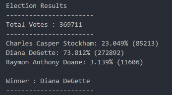

# **Rural Vote Modernization Initiative**

[Resources](https://github.com/lovecy86/Rural-Vote-Modernization-Initiative/blob/main/Resources/election_data.csv)

[Voter Analysis Script](https://github.com/lovecy86/Rural-Vote-Modernization-Initiative/blob/main/main.py)

[Result](https://github.com/lovecy86/Rural-Vote-Modernization-Initiative/blob/main/analysis/election_analysis.txt)

## **Overview**
The RuralVote Modernization Initiative aims to streamline the vote-counting process for a small, rural town by automating the analysis of election data. This Python script processes a dataset (election_data.csv) containing voter information and produces key election metrics, including total votes, candidate vote counts and the election winner based on the popular vote. The script is designed to be efficient, accurate, and easy to use, modernizing traditional vote-counting methods.

## **Stakeholder and the Business Question**
The stakeholders for this project are the voters or the citizens of  the town who wants to know the following:
* The total number of votes cast.
* A complete list of candidates who received votes.
* The percentage of votes each candidate won.
* The total number of votes each candidate won.
* The winner of the election based on popular vote.

## **Technology Used**
Python

## **Prerequisites**

* Python 3.x installed on your system.
* The election_data.csv dataset, which includes three columns:
    * Voter ID: Unique identifier for each voter.
    * County: The county where the vote was cast.
    * Candidate: The candidate the voter selected.

## **Result**

